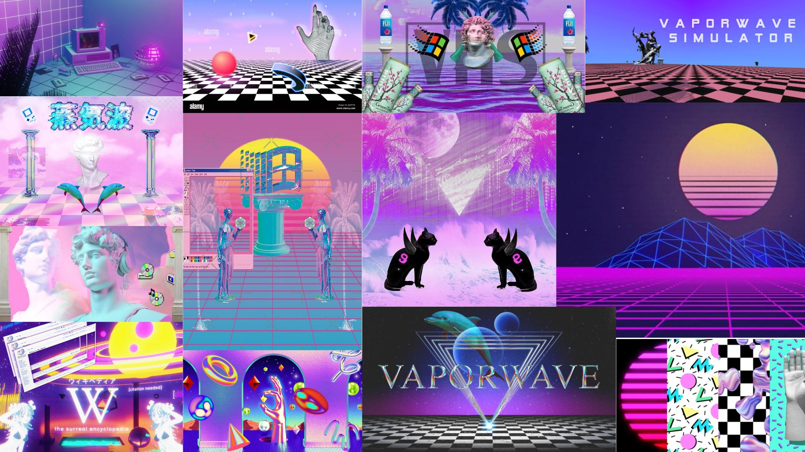

# Vektroid Experience



## Concept

Notre projet se nomme Vektroid Experience. Vektroid est une artiste américaine reconnue dans le mouvement vaporwave, et nous nous sommes inspirés de son univers pour concevoir notre site web. Le vaporwave est un genre musical rétro, chill et expérimental. C'est pourquoi l'ambiance de notre site s'articule autour du thème de Windows XP, agrémentée d'images et de modèles 3D qui, bien qu'apparemment dépareillés, créent une impression de désordre organisé. Le tout est animé par des transitions fluides et douces qui renforcent l'expérience immersive.

## Expérience utilisateur

Le site propose également une expérience narrative guidée. L'utilisateur doit créer sa propre cassette avec un design à la fois généré automatiquement et personnalisable, afin de concevoir sa propre pochette d'album dans le style de Vektroid. Une fois créée, la cassette peut être extraite directement de l'ordinateur pour être insérée dans un walkman virtuel, permettant ainsi de se laisser porter par la musique.

Bonne expérience !

---

## Stack technique

| Technologie | Description |
|-------------|-------------|
| **HTML5** | Structure de la page et éléments sémantiques |
| **CSS3** | Styles, animations et effets visuels (gradients, transitions, custom cursor) |
| **JavaScript (Vanilla)** | Logique d'interaction, gestion des états et animations |
| **Three.js** | Rendu 3D des modèles et scènes interactives |
| **Web Audio API** | Lecture audio des pistes de l'album Floral Shoppe |

### Architecture du projet

```
projet-vektroide/
├── index.html              # Point d'entrée de l'application
├── main.js                 # Logique principale et gate de chargement XP
├── styles.css              # Feuille de styles principale
├── FloralShoppeCassette/   # Assets audio et visuels de l'album
├── image_paint/            # Images dont le moodboard
├── source/                 # Ressources additionnelles
└── textures/               # Textures pour les modèles 3D
```

---

## Lancer l'application

### Option 1 : VS Code avec Live Server (recommandé)

1. Ouvrir le projet dans VS Code
2. Installer l'extension **Live Server** si ce n'est pas déjà fait
3. Clic droit sur `index.html` > **Open with Live Server**
4. Le site s'ouvre automatiquement dans le navigateur

### Option 2 : Serveur HTTP Python

```bash
# Python 3
python -m http.server 8000

# Puis ouvrir http://localhost:8000 dans le navigateur
```

### Option 3 : Node.js avec npx

```bash
npx serve .

# Puis ouvrir l'URL affichée dans le terminal
```

> **Note** : Un serveur local est nécessaire car le projet utilise des modules ES6 et charge des ressources locales (audio, textures 3D).
